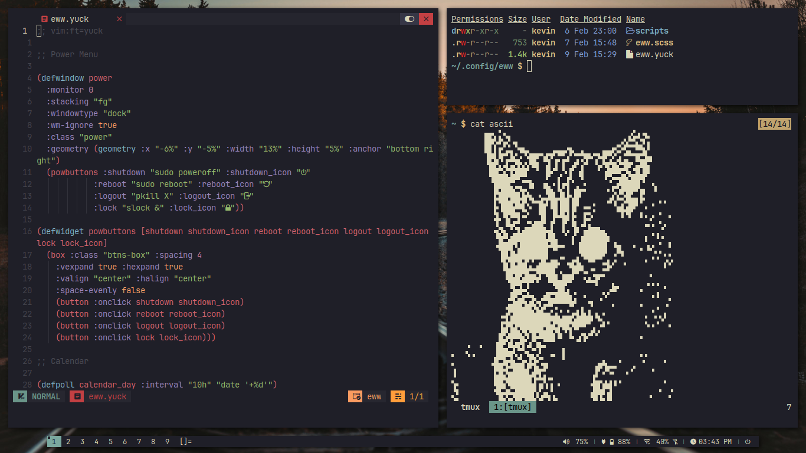
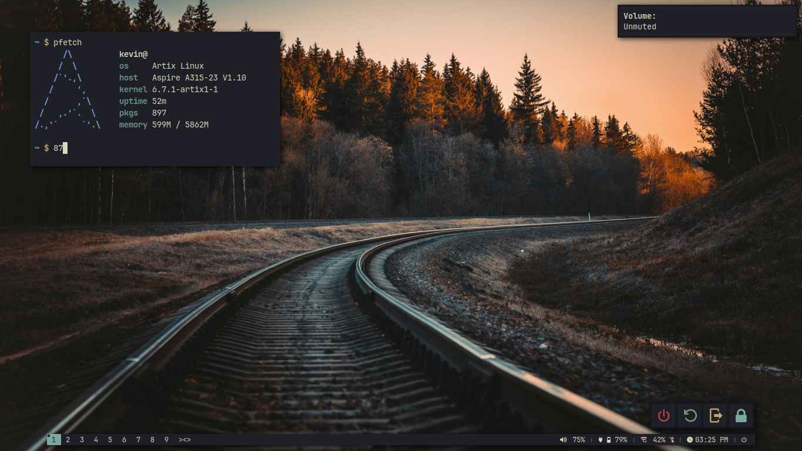

# My Suckless System

`"kind of bloated"`

## Screenshots

## Info

- os: Artix Linux
- wm: dwm
- term: st
- launcher: dmenu
- lockscreen: slock
- bar: dwmblocks-async
- shell: mksh/dash
- editor: NvChad (Neovim)
- notifs: dunst
- compositor: compfy
- widgets: eww

## Credit

- `sb-internet` is modified from [Luke Smith's script](https://github.com/LukeSmithxyz/voidrice/blob/master/.local/bin/statusbar/sb-internet)
- `sb-volume sb-battery, and sb-date` are modified from [Utkarsh Varma's scripts](https://github.com/UtkarshVerma/dotfiles/tree/main/.local/bin/statusbar)

## Other

- My suckless repo: https://github.com/22email/suckless
- My NvChad config: https://github.com/22email/nvchad-config
