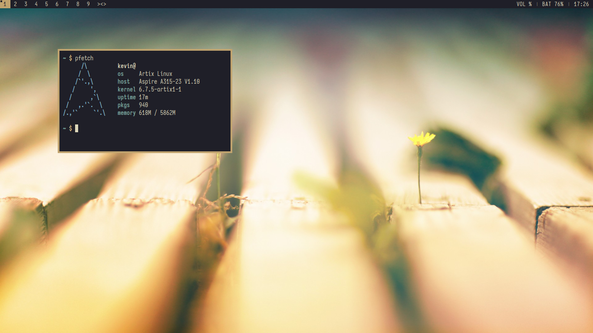

# My Suckless System

`sucks slightly less`

## Screenshot

    
## Info

- os: Artix Linux
- wm: dwm
- term: st
- launcher: dmenu
- lockscreen: slock
- bar: dwmblocks-async
- shell: mksh/dash
- editor: NvChad (Neovim)
- notifs: dunst
- compositor: compfy (I have this off most of the time)

## Credit

- statusbar scripts are modified from [Utkarsh Varma's scripts](https://github.com/UtkarshVerma/dotfiles/tree/main/.local/bin/statusbar)
- Wallpapers from [dkeg](https://github.com/dkeg/crayolo)

## Other

- My suckless repo: https://github.com/22email/suckless
- My NvChad config: https://github.com/22email/nvchad-config
